Practical Malware Analysis & Triage

Malware Analysis Report

C2[.]Bootstrap[.]Dropper[.]Loader

January 2, 2026 \| Clinton Asprey\| v1.0

# Table of Contents

[Table of Contents [2](#_Toc220233315)](#_Toc220233315)

[Executive Summary [4](#executive-summary)](#executive-summary)

[Analysis Environment & Methodology
[5](#analysis-environment-methodology)](#analysis-environment-methodology)

[High-Level Technical Summary
[7](#high-level-technical-summary)](#high-level-technical-summary)

[Execution Timeline [8](#execution-timeline)](#execution-timeline)

[Malware Composition [10](#malware-composition)](#malware-composition)

[EmbedDLL.dll [10](#embeddll.dll)](#embeddll.dll)

[embed.vbs [10](#_Toc220233322)](#_Toc220233322)

[embed.xml [11](#_Toc220233323)](#_Toc220233323)

[Basic Static Analysis
[12](#basic-static-analysis)](#basic-static-analysis)

[Stage 1 - Loader [12](#_Toc220233325)](#_Toc220233325)

[Stage 2 - EmbedDLL [13](#stage-1-embeddll.dll)](#stage-1-embeddll.dll)

[Stage 3 – VBScript Launcher
[15](#stage-2-vbscript-persistent-launcher)](#stage-2-vbscript-persistent-launcher)

[Stage 4: C2 Agent
[16](#stage-3-grunt-http-stager)](#stage-3-grunt-http-stager)

[Basic Dynamic Analysis
[17](#basic-dynamic-analysis)](#basic-dynamic-analysis)

[Stage 1 [21](#_Toc220233330)](#_Toc220233330)

[Stage 2 [21](#_Toc220233331)](#_Toc220233331)

[Stage 3 [21](#_Toc220233332)](#_Toc220233332)

[Stage 4 [21](#_Toc220233333)](#_Toc220233333)

[Advanced Static Analysis
[22](#advanced-static-analysis)](#advanced-static-analysis)

[Stage 1 [24](#_Toc220233335)](#_Toc220233335)

[Stage 2 [24](#_Toc220233336)](#_Toc220233336)

[Stage 3 [24](#_Toc220233337)](#_Toc220233337)

[Stage 4 [24](#_Toc220233338)](#_Toc220233338)

[Advanced Dynamic Analysis
[25](#advanced-dynamic-analysis)](#advanced-dynamic-analysis)

[Indicators of Compromise
[26](#indicators-of-compromise)](#indicators-of-compromise)

[Stage 1 [26](#_Toc220233341)](#_Toc220233341)

[Stage 2 [27](#_Toc220233342)](#_Toc220233342)

[Stage 3 [29](#_Toc220233343)](#_Toc220233343)

[Stage 4 [29](#_Toc220233344)](#_Toc220233344)

[Rules & Signatures [30](#rules-signatures)](#rules-signatures)

[Appendices [34](#appendices)](#appendices)

[A. Yara Rules [34](#yara-rules)](#yara-rules)

[B. Callback URLs [35](#callback-urls)](#callback-urls)

[C. Decompiled Code Snippets
[35](#decompiled-code-snippets)](#decompiled-code-snippets)

[Analyst Summary [36](#analyst-summary)](#analyst-summary)

[MITRE ATT&CK Technique Mapping
[36](#mitre-attck-technique-mapping)](#mitre-attck-technique-mapping)

# Executive Summary

| SHA256 hash | 732f235784cd2a40c82847b4700fb73175221c6ae6c5f7200a3f43f209989387 |
|-------------|------------------------------------------------------------------|

This report analyzes the EmbedDLL[.]dll malware, a .NET-based encrypted
dropper and loader that deploys a secondary payload using DLL reflection
and Living-off-the-Land binaries. The malware is designed to evade
static detection through AES-encrypted embedded resources and reflective
assembly loading. Persistence is achieved via registry Run keys and
execution is proxied through MSBuild. C2 server beaconing is also
established.

Analysis Note: The DLL sample (Malware[.]cryptlib64[.]dll) requires a
hosting process for execution. For this analysis, a minimal .NET loader
was created to facilitate dynamic analysis. The loader is not part of
the malware distribution chain but serves as an analysis tool.

# Analysis Environment & Methodology

## Controlled Execution Setup

To analyze the managed .NET DLL (Malware[.]cryptlib64[.]dll), a controlled
execution environment was established. The DLL requires a hosting
process, as it contains managed code entry points that cannot execute
standalone.

##  Custom Loader Implementation

> To debug Malware[.]cryptlib64[.]dll, this analyst created a .NET 4.7.2
> console application named Loader[.]exe in Visual Studio Community to
> load the DLL code.
>
> **Loader[.]exe is not part of the original malware sample.**

This loader mimics real-world execution patterns by:

- Loading Mechanism: Using .NET Reflection APIs Assembly\[.\]LoadFile(),
  MethodInfo\[.\]Invoke()

- Entry Point: Calling EmbedDLL\[.\]Program\[.\]embed() method

- Isolation: Running in a controlled VM with monitoring tools

Loader Purpose: Enable observation of DLL’s core functionality
independent of specific delivery chains.

Real-World Equivalents: Similar loading techniques are observed in:

- Office macro payloads

- PowerShell/Cscript stagers

- Exploit kit second-stage loaders

- Legitimate process abuse (e.g., regsvr32, installutil)

## Monitoring Tools & Setup

- **Static Analysis:** Floss, PEStudio, Cutter

- **Network:** Wireshark, FakeNet-NG, Inetsim

- **System:** Process Monitor, API Monitor

- **Memory:** System Informer

- **.NET-specific:** dnSpy, dnSpy-x86

## Assumptions & Limitations

- The DLL's behavior is analyzed independent of initial infection vector

- C2 infrastructure was simulated/isolated to prevent external
  communication

- All findings reflect the DLL's capabilities when properly loaded

# High-Level Technical Summary

The analyzed DLL functions as a persistence-focused payload dropper.
Upon execution, it decrypts a hardcoded password-derived key, writes the
decrypted XML payload to disk, and installs a VBScript launcher in the
user’s startup registry. This VBScript leverages MSBuild to execute the
embedded XML payload, enabling fileless or proxy execution while
maintaining persistence across reboots. Callback to a C2 server is also
initiated.

# Execution Timeline

1.  Execution of EmbedDLL[.]dll

2.  AES decryption of embedded payload

3.  Decrypted XML payload written to disk

4.  VBS launcher created

5.  Persistence via Run registry key

6.  MSBuild execution of decrypted payload

7.  Reflective assembly load

8.  Encrypted C2 communication begins

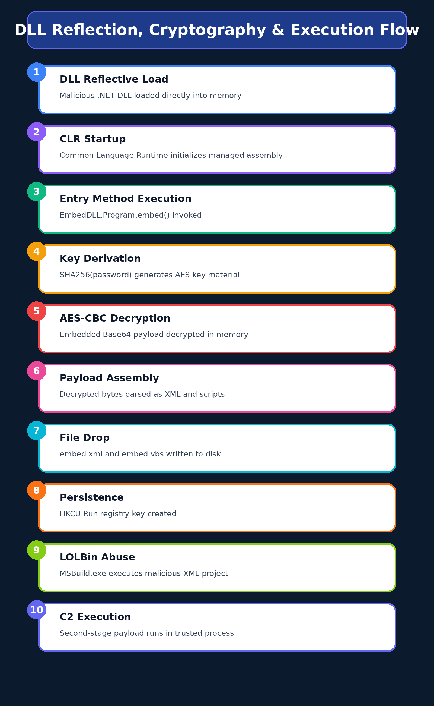

# Malware Composition

Malware[.]cryptlib64[.]dll consists of the following components:

| File Name    | SHA256 Hash                                                      |
|--------------|------------------------------------------------------------------|
| EmbedDLL[.]dll | 732f235784cd2a40c82847b4700fb73175221c6ae6c5f7200a3f43f209989387 |
| embed[.]vbs    | 66fd543f31545082cf8fcc45a6ab1094bc118c45634f2be450f84f4e5745b291 |
| embed[.]xml    | f1548cd02784606c8abac865abf5ed6220d34eea88c7a5715e0183d7f050f4ab |

## EmbedDLL[.]dll

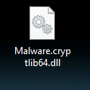

*Figure 1: The hidden file name of Malware[.]cryptlib64[.]dll is
EmbedDLL[.]dll which is detonated in this lab with rundll32.*

embed[.]vbs

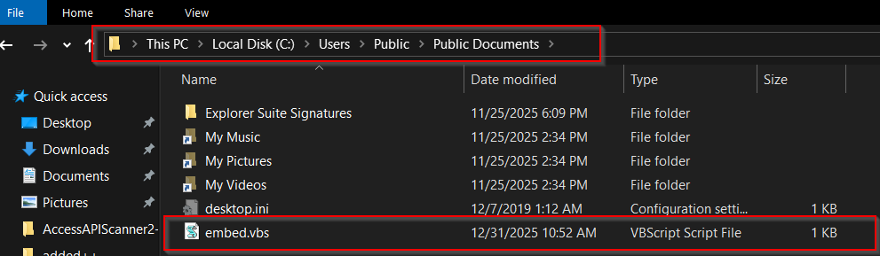

*Figure 2: embed[.]vbs VBscript dropped by EmbedDLL[.]dll and ran upon user
login*

embed\[.\]xml

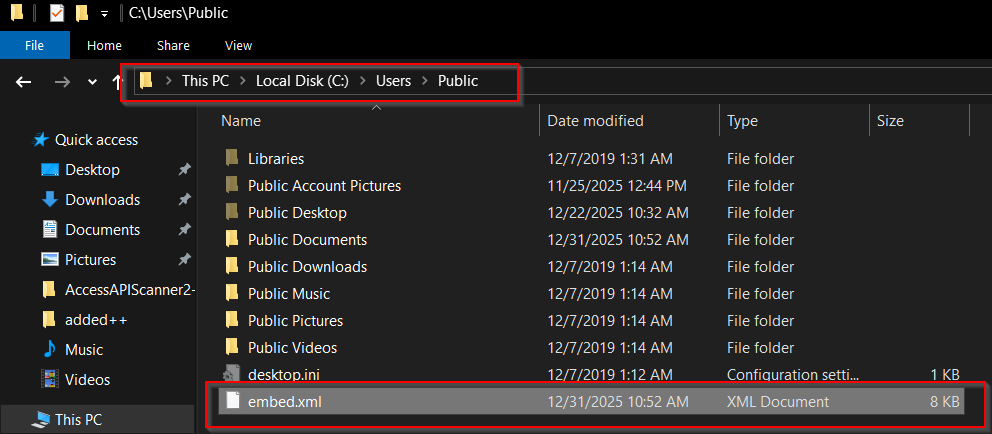

*Figure 3: The XML payload is dropped in Public user folder*

# Basic Static Analysis

{Screenshots and description about basic static artifacts and methods}

## Stage 1 – EmbedDLL[.]dll

- **Filename: Malware[.]cryptlib64[.]dll**

- **File size: 29184** bytes

- **Entropy:** 4.178

- **File type:** dynamic-link-library, 64-bit, console

- **Architecture:** x64

- **Compilation timestamp: Sun** Oct 10 18[:]14[:]49 2021 (UTC)

- **Digital signature: None**

- **Suspicious sections:** .sdata

- **Embedded resources:** EmbedDLL[.]dll

- **Indicators of packing or encryption:** AES Encryption

- **Anti-analysis techniques observed:** Hidden File Name (EmbedDLL[.]dll)

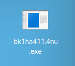

*Figure : Hidden file name*

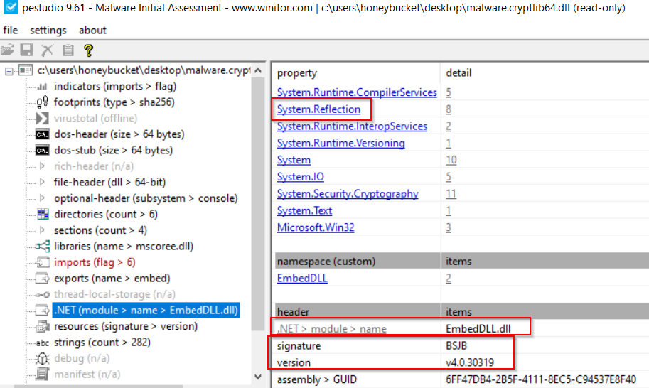

*Figure : .NET module detected*

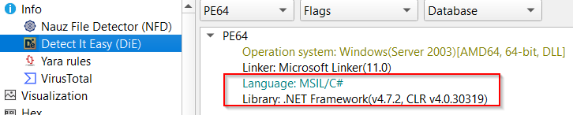

*Figure: Indicators of C# language and .NET Framework*

**Notable Strings and Indicators**

1.  **These indicate a .NET loader:**

    1.  v4.0.30319

    2.  mscoree[.]dll

    3.  System[.]Reflection

    4.  Assembly[.]Load

2.  **Embedded Payload Indicators:**

    1.  EmbedDLL[.]dll

    2.  EmbedDLL

    3.  \EmbedDLL[.]dll

    4.  InternalName: EmbedDLL[.]dll

    5.  OriginalFilename: EmbedDLL[.]dll

3.  **AES Encryption of Embedded Payload Indicators:**

    1.  System[.]Security[.]Cryptography

    2.  RijndaelManaged

    3.  Rfc2898DeriveBytes

    4.  AES_Encrypt

    5.  AES_Decrypt

    6.  passwordBytes

    7.  bytesToBeEncrypted

    8.  bytesToBeDecrypted

4.  **Hardcoded Password:**

    1.  p0w3r0verwh3lm1ng!

5.  **Large Base64 / High Entropy Blobs:**

    1.  pxQRI8YJc6jVr3x45Y+ti/tT8W+3HpQHbcw1yZJQ9goNh...

6.  **In-Memory Execution Indicators:**

    1.  System\[.\]Reflection

    2.  MemoryStream

    3.  Assembly

    4.  InitializeArray

    5.  MethodInfo[.]Invoke (implied)

7.  **Script-based Secondary Execution:**

    1.  U2V0IG9TaGVsbCA9IENyZWF0ZU9iamVjdCAoIldzY3JpcHQuU2hlbGwiKSAK...
        which converts to
        C:\Windows\Microsoft\[.\]NET\Framework\v4.0.30319\MSBuild\[.\]exe

8.  **LoL Execution Script Drop Location:**

    1.  C:\Users\Public\Documents\embed\[.\]vbs

9.  **Persistence Mechanism Registry Key:**

    1.  HKCU\Software\Microsoft\Windows\CurrentVersion\Run

## Stage 2 – VBScript Persistent Launcher

**Notable Strings and Indicators**

## Stage 3: Grunt HTTP Stager

- Filen**ame:** bk1ha411[.]4nu[.]exe

- **SHA256:**
  B8E0EC99C18BF28062FFB9BB385C0109A27AF71D332BC7FC00580D88D3A30721

- **Entropy:** 5.181

- **File Size:** 11776 bytes

- **File Type:** MZ

- **Architecture:** x64

**Notable Strings and Indicators**

1.  **Hardcoded C2 endpoint:**  
    hxxp://srv\[.\]masterchiefsgruntemporium\[.\]local:80

2.  **Beacon parameter format:**  
    i=\<id\>&data={encrypted}&session=\<token\>

3.  **HTTP masquerading:**

    1.  User-Agent: Mozilla/5.0 (Windows NT 6.1)…Chrome/41.0…

    2.  Cookie template: ASPSESSIONID={GUID}; SESSIONID=…

4.  **Encrypted message structure:**

    1.  {"GUID":"{0}","Type":{1},"Meta":"{2}","IV":"{3}",

    2.  "EncryptedMessage":"{4}","HMAC":"{5}"}

5.  **Certificate pinning indicators:**

    1.  ValidateCert

    2.  CovenantCertHash

    3.  UseCertPinning

6.  **Framework identifiers:**  
    GruntStager

    1.  ExecuteStager

    2.  CookieWebClient

**Notable Strings and Indicators**

# Basic Dynamic Analysis

{Screenshots and description about basic dynamic artifacts and methods}

This DLL functions as an encrypted dropper-loader responsible for
decrypting, staging, and executing a secondary payload via MSBuild,
while establishing user-level persistence.

During execution, the malware encrypts command-and-control (C2)
communications using AES-256 in CBC mode. Key material is derived via
PBKDF2 with SHA-1 (1,000 iterations) and a hard-coded password encoded
as UTF-16LE. Network traffic captured from the sample shows that
encrypted messages are Base64-encoded prior to transmission.

Once decrypted, the C2 payload does not conform to any standard
serialization or compression format. Instead, it consists of a
proprietary binary protocol composed of fixed-length fields. These
fields include a session identifier resembling a GUID, followed by
structured metadata such as opcode values, host identifiers, and status
or command data. No evidence of secondary compression or obfuscation is
present beyond the initial AES encryption layer.

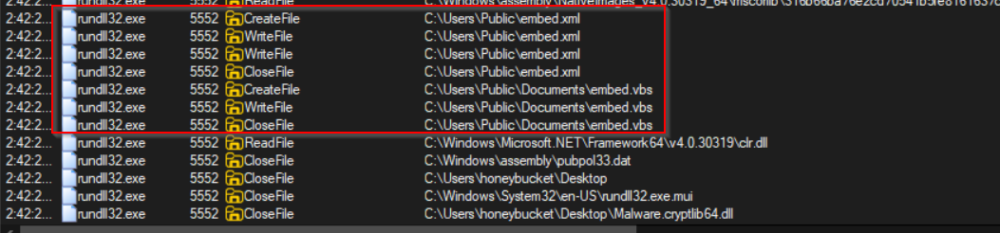

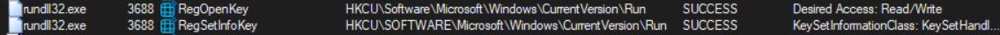

*Figure : ProcMon shows files dropped and registry key set upon first
run*

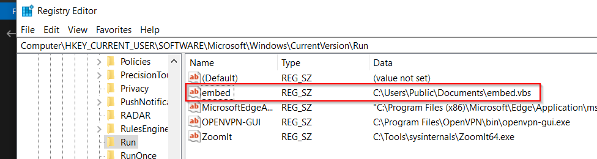

*Figure : Persistence registry key created after initial EmbedDLL[.]dll
execution*

*Figure : Wireshark packet capture showing HTTP call to C2 server*

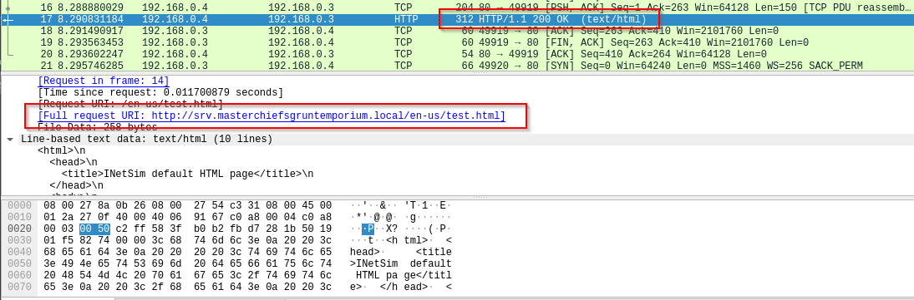

*Figure : Successful request on port 80*

Each time the infected machine’s user logs back in, embed[.]vbs is
executed with embed[.]xml arguments and the C2 server is contacted.
VBScript is used to launch a system shell and run MSBuild indirectly to
evade detection.

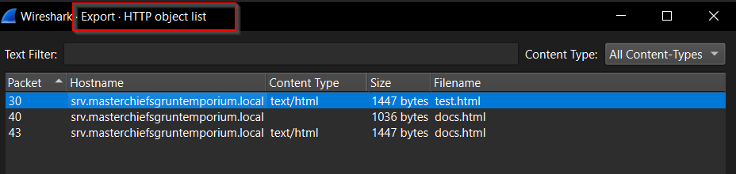

*Figure : XML arguments for embed\[.\]vbs to run MSBuild*

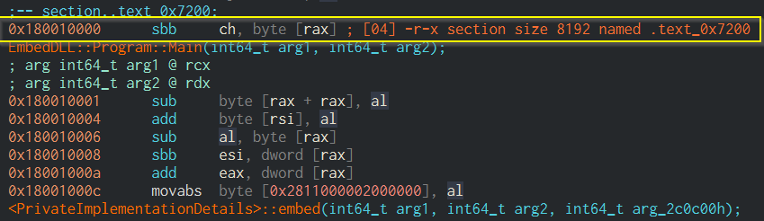

*Figure : Ncat and Wireshark captured C2 beacon for decryption*

Figure : Exported HTML POST file from PCAP

After decrypting the message portion in this HTTP POST we can identify
these possible parts:

Total bytes: 64

> GUID : 4f1113988d3b14972c77
>
> Opcode : 0x154615aa
>
> Payload length: 50
>
> Beacon ID : 0x8938d318 (2302202648)
>
> Uptime low : 0x38a4de1c (950328860)
>
> Uptime high : 0xdd007378 (3707794296)
>
> Flags : 0x5d30d302 (1563480834)
>
> OS version : 0x0d221e46 (220339782)
>
> PID : 0x1db5043a (498402362)
>
> PPID : 0xd584cc5d (3582250077)
>
> Arch : 0x981f4c53 (2552187987)
>
> Privilege : 0x8e487bff (2387115007)
>
> Net status : 0x162a26c5 (371861189)
>
> Unknown 1 : 0x30ca19da (818551258)
>
> Unknown 2 : 0x3c6764c9 (1013408969)
>
> Checksum : 0x00005a13 (23059)

## Stage 1 – EmbedDLL[.]dll

## Stage 2 – VBScript Persistent Launcher

## Stage 3: Covenant Framework - C2 Grunt Stager

Figure : The implant issues an HTTP GET request to the /stream endpoint
with a custom authorization token and session identifier.

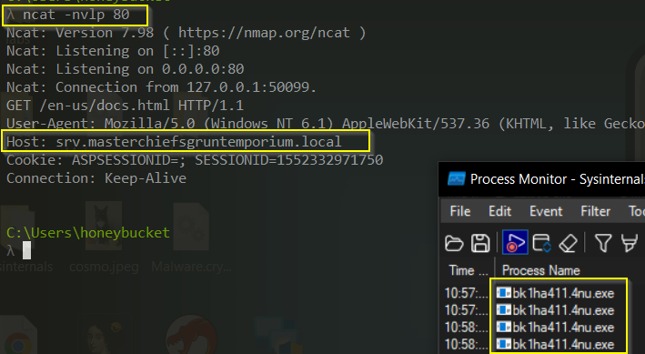

Figure X. HTTP-based beacon request captured on the loopback interface
while emulating a C2 server using ncat. All network indicators have been
defanged.

| Frame 20: 372 bytes on wire (2976 bits), 372 bytes captured (2976 bits) on interface \Device\NPF_Loopback, id 0 |
|-----------------------------------------------------------------------------------------------------------------|
| Null/Loopback                                                                                                   |
| Internet Protocol Version 4, Src: 127\[.\]0\[.\]0\[.\]1, Dst: 127\[.\]0\[.\]0\[.\]1                             |
| Transmission Control Protocol, Src Port: 50140, Dst Port: 5133, Seq: 1, Ack: 1, Len: 328                        |
| Source Port: 50140                                                                                              |
| Destination Port: 5133                                                                                          |
| \[Stream index: 3\]                                                                                             |
| \[Stream Packet Number: 4\]                                                                                     |
| \[Conversation completeness: Incomplete, DATA (15)\]                                                            |
| \[TCP Segment Len: 328\]                                                                                        |
| Sequence Number: 1 (relative sequence number)                                                                   |
| Sequence Number (raw): 3547991908                                                                               |
| \[Next Sequence Number: 329 (relative sequence number)\]                                                        |
| Acknowledgment Number: 1 (relative ack number)                                                                  |
| Acknowledgment number (raw): 77053556                                                                           |
| 0101 .... = Header Length: 20 bytes (5)                                                                         |
| Flags: 0x018 (PSH, ACK)                                                                                         |
| Window: 10233                                                                                                   |
| \[Calculated window size: 2619648\]                                                                             |
| \[Window size scaling factor: 256\]                                                                             |
| Checksum: 0x5fe2 \[unverified\]                                                                                 |
| \[Checksum Status: Unverified\]                                                                                 |
| Urgent Pointer: 0                                                                                               |
| \[Timestamps\]                                                                                                  |
| \[SEQ/ACK analysis\]                                                                                            |
| TCP payload (328 bytes)                                                                                         |
| Hypertext Transfer Protocol                                                                                     |
| GET /stream HTTP/1.1\r\n                                                                                        |
| Request Method: GET                                                                                             |
| Request URI: /stream                                                                                            |
| Request Version: HTTP/1.1                                                                                       |
| host: localhost:5133\r\n                                                                                        |
| connection: keep-alive\r\n                                                                                      |
| authorization: d623295c3e95e6c346f33d3c44f39b2b7f7a5630753f352abcc077a47f3dac5a\r\n                             |
| Accept: text/event-stream\r\n                                                                                   |
| Mcp-Session-Id: 0f6090c6d9b9f4ed8a2cd47ec7c92339c1267245\r\n                                                    |
| accept-language: \*\r\n                                                                                         |
| sec-fetch-mode: cors\r\n                                                                                        |
| user-agent: node\r\n                                                                                            |
| accept-encoding: gzip, deflate\r\n                                                                              |
| \r\n                                                                                                            |
| \[Full request URI: hxxp://localhost:5133/stream\]                                                              |

# Advanced Static Analysis

{Screenshots and description about findings during advanced static
analysis}

Advanced static analysis of the malware reveals a **multi-stage dropper
and loader** implemented as a **.NET DLL** with deliberate obfuscation
and nonstandard execution behavior to hinder debugging and automated
analysis.

The DLL is not intended to be executed directly via standard loaders,
which explains debugger errors such as *“invalid extension”* when
attempting to run it in dnSpy. Instead, it is designed for **reflective
or indirect loading.**

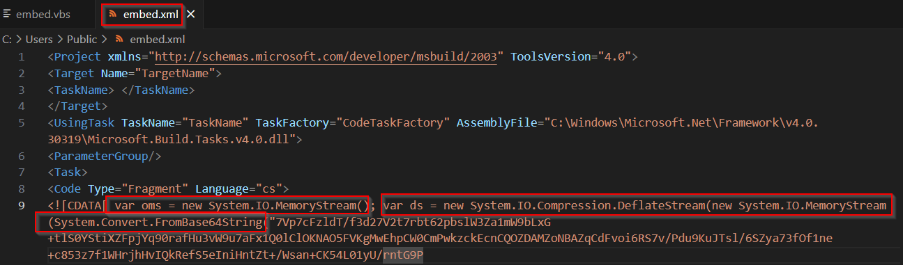

*Figure : Hardcoded password and AES decryption of a base64 string*

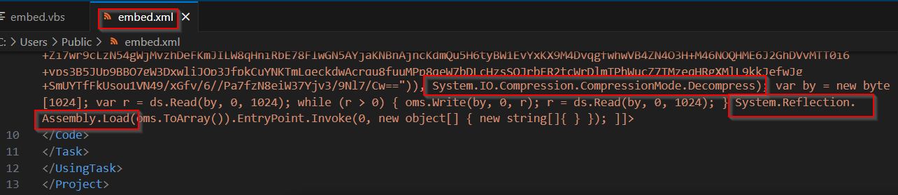

*Figure : AES encryption function*

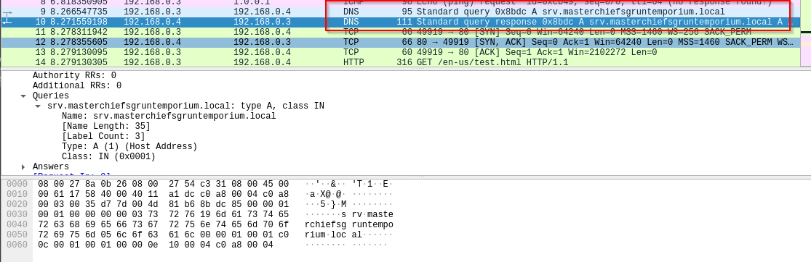

*Figure : Name and location of dropped VBS script and XML file to be
loaded at user logon*

**Static Analysis Key Findings**

- The malware stores its primary payload as an encrypted, Base64-encoded
  embedded resource within the DLL, preventing plaintext exposure on
  disk. Decryption is performed at runtime using a custom AES-256-CBC
  implementation with PBKDF2 (SHA-1, 1000 iterations) and a hardcoded
  UTF-16LE password, with all cryptographic parameters statically
  defined.

- Once decrypted, the payload is assembled entirely in memory as a
  custom binary structure rather than a standard PE or serialized
  format. The data layout includes fixed-length fields consistent with
  session identifiers, timestamps, flags, and command metadata.

- Execution relies on reflective loading and dynamic invocation of
  managed code, avoiding disk-backed module loading. Static code paths
  also reveal registry-based persistence and indirect execution via
  trusted Windows binaries, enabling living-off-the-land techniques.

- Network communication uses a bespoke binary C2 protocol, with manually
  packed and parsed messages instead of common serialization formats,
  indicating deliberate evasion of signature-based detection.

## Stage 1 – EmbedDLL[.]dll

## Stage 2 – VBScript Persistent Launcher

## Stage 3: Grunt HTTP Stager

# Advanced Dynamic Analysis

{Screenshots and description about advanced dynamic artifacts and
methods}

# Indicators of Compromise

The full list of IOCs can be found in the Appendices.

## Stage 1 – EmbedDLL[.]dll

| Category | Indicator              | Type           | Stage   | Description                                            |
|----------|------------------------|----------------|---------|--------------------------------------------------------|
|          |                        |                |         |                                                        |
| File     | Malware[.]cryptlib64[.]dll | DLL            | Stage 1 | Primary dropper and decrypter component                |
| File     | embed[.]xml              | XML Payload    | Stage 1 | Contains decrypted Stage 2 payload                     |
| File     | embed[.]vbs              | VBS Script     | Stage 1 | Executes decrypted payload and establishes persistence |
| Registry | HKCU...\Run            | Run Key        | Stage 1 | Registry auto-start persistence mechanism              |
| API      | Assembly[.]LoadFile      | Reflection API | Stage 1 | Dynamically loads malicious DLL into memory            |
| Crypto   | AES_Decrypt            | Function Call  | Stage 1 | Decrypts embedded encrypted payload                    |

*Fig 3: Wireshark packet capture of initial DNS query for callback to C2
server*

*Fig 4:.*

## Stage 2 – VBScript Persistent Launcher

| Category       | Indicator                                                                                            | Type                   | Description                                                                       |
|----------------|------------------------------------------------------------------------------------------------------|------------------------|-----------------------------------------------------------------------------------|
| Network        | hxxp://srv\[.\]masterchiefsgruntemporium\[.\]local:80                                                | C2 URL                 | Hardcoded command-and-control endpoint used by the implant                        |
| Network        | /en-us/index\[.\]html                                                                                | URI Path               | Decoy HTTP path used during beaconing                                             |
| Network        | /en-us/docs\[.\]html                                                                                 | URI Path               | Alternate decoy path for C2 communications                                        |
| Network        | /en-us/test\[.\]html                                                                                 | URI Path               | Alternate decoy path for C2 communications                                        |
| Network        | i=a19ea23062db990386a3a478cb89d52e&data={0}&session=75db-99b1-25fe4e9afbe58696-320bea73              | HTTP Parameter Pattern | Beacon request format containing implant ID, encrypted payload, and session token |
| Network        | Mozilla/5.0 (Windows NT 6.1) AppleWebKit/537.36 (KHTML, like Gecko) Chrome/41.0.2228.0 Safari/537.36 | User-Agent             | Hardcoded User-Agent string used to masquerade as Chrome traffic                  |
| Network        | ASPSESSIONID={GUID}; SESSIONID=1552332971750                                                         | Cookie Template        | Session cookie format used for C2 communication                                   |
| C2 Protocol    | {"GUID":"{0}","Type":{1},"Meta":"{2}","IV":"{3}","EncryptedMessage":"{4}","HMAC":"{5}"}              | JSON Message Format    | Encrypted C2 message structure containing IV, ciphertext, and HMAC                |
| Host           | bk1ha411[.]4nu[.]exe                                                                                     | Filename               | Observed implant executable filename                                              |
| Host           | bk1ha411.4nu                                                                                         | Implant ID             | Base implant name used internally by the malware                                  |
| Crypto         | HMACSHA256                                                                                           | Algorithm              | Message authentication algorithm used to protect C2 traffic                       |
| Crypto         | aFM+yqzILW3R/AY/pnxI8VIYvdjnPdfYw8Xlqy31tvU=                                                         | Base64 Key / Hash      | Embedded cryptographic material used for HMAC or key derivation                   |
| Crypto         | c638eb59a8                                                                                           | Token / Identifier     | Short embedded identifier associated with encryption or session handling          |
| TLS / Evasion  | UseCertPinning                                                                                       | Function Name          | Enables certificate pinning to prevent TLS interception                           |
| TLS / Evasion  | ValidateCert                                                                                         | Function Name          | Custom certificate validation routine                                             |
| TLS / Evasion  | CovenantCertHash                                                                                     | Certificate Hash Label | Pinned certificate hash associated with Covenant framework                        |
| Malware Family | GruntStager                                                                                          | Class Name             | Covenant framework stager identifier                                              |
| Malware Family | ExecuteStager                                                                                        | Function Name          | Primary routine responsible for staging payload execution                         |
| Malware Family | CookieWebClient                                                                                      | Class Name             | Custom HTTP client wrapper used for C2 communications                             |

## Stage 3: Grunt HTTP Stager

Analysis Artifacts (NOT MALICIOUS)

\- Loader[.]exe (custom analysis tool, SHA256: ...)

\- Debug symbols from controlled execution

# Rules & Signatures

A full set of YARA rules is included in Appendix A.

{Information on specific signatures, i.e. strings, URLs, etc}

**Static File Signatures**

The malware can be reliably identified using a combination of the
following static indicators:

- **Hardcoded cryptographic artifacts**

  - UTF-16LE encoded AES password string used for PBKDF2 key derivation

  - Fixed PBKDF2 parameters (SHA-1, 1000 iterations, static salt)

- **Embedded resource indicators**

  - Presence of encrypted Base64 blobs stored in .rsrc / .rsdata
    sections

  - Resource names and namespaces consistent with embedded payload
    handling (e.g., EmbedDLL)

- **.NET reflection artifacts**

  - References to System[.]Reflection[.]Assembly::Load

  - Dynamic invocation patterns (GetType, GetMethod, Invoke)

- **Custom protocol constants**

  - Fixed-length binary structures used after decryption (e.g., 64-byte
    beacon headers)

  - Repeated magic values and field offsets associated with GUID/session
    identifiers

**Behavioral / Heuristic Signatures**

Additional detection opportunities exist through behavior-based rules:

- **In-memory execution**

  - Assembly loading directly from byte arrays without dropping a PE to
    disk

- **Persistence mechanisms**

  - Registry modification under:

  - HKCU\Software\Microsoft\Windows\CurrentVersion\Run

- **Living-off-the-Land execution**

  - Use of trusted Windows binaries (e.g., MSBuild[.]exe) to execute
    attacker-controlled code indirectly

- **Custom cryptographic routines**

  - Manual AES decryption logic rather than use of standard secure
    communication libraries

**Network & C2 Signatures**

Although encrypted, C2 traffic exhibits detectable structure:

- **Deterministic AES-CBC encryption**

  - Static key derivation allows retrospective decryption of captured
    traffic

- **Non-standard application protocol**

  - Fixed-size binary messages rather than JSON, XML, or known
    serialization formats

  - Consistent ordering of fields such as session identifiers,
    timestamps, command IDs, and flags

- **Absence of compression**

  - Payload entropy consistent with encryption only, without secondary
    compression layers

# Appendices

## Yara Rules

Full Yara repository located at:
hxxps://github[.]com/scryptic86/EmbedDLL-C2-C-Sharp

rule EmbedDLL_PowerOverwhelming_AES_C2

{

    meta:

        author = "Clinton Asprey"

        description = "Detects EmbedDLL AES-C2 implementation"

        confidence = "high"

        malware_family = "Custom C2 .NET backdoor"

        last_updated = "2026-01-02"

    strings:

        / Password (UTF-16LE) /

        \$pwd = "p0w3r0verwh3lm1ng!" wide

        / PBKDF2 salt /

        \$salt = { 01 02 03 04 05 06 07 08 }

        / .NET crypto /

        \$rij = "RijndaelManaged"

        \$pbkdf = "Rfc2898DeriveBytes"

        / JSON C2 fields /

        \$json1 = "\\EncryptedMessage\\"

        \$json2 = "\\IV\\"

        \$json3 = "\\HMAC\\"

        \$json4 = "\\GUID\\"

        / Reflection loading /

        \$reflect = "System\[.\]Reflection"

    condition:

        uint16(0) == 0x5A4D and   // PE

        all of (\$json) and

        \$salt and

        \$pwd and

        2 of (\$rij, \$pbkdf, \$reflect)

}

## Callback URLs

| Domain                                              | Port |
|-----------------------------------------------------|------|
| hxxp:// srv\[.\]masterchiefsgruntemporium\[.\]local | 80   |
|                                                     |      |
|                                                     |      |

## Decompiled Code Snippets

*Fig 5:*

# Analyst Summary

This malware represents a classic encrypted loader design leveraging AES
encryption, registry persistence, and LOLBins (MSBuild) for stealthy
execution. The use of reflection and encrypted embedded payloads
significantly complicates static detection while maintaining simple
operational logic.  
  
Detection should prioritize cryptographic API usage, registry
persistence patterns, and anomalous MSBuild invocation.

# MITRE ATT&CK Technique Mapping

T1055 – Process Injection / Reflective DLL Loading

T1027 – Obfuscated / Encrypted Payloads

T1059.005 – Command and Scripting Interpreter: Visual Basic

T1218.005 – Signed Binary Proxy Execution: MSBuild

T1547.001 – Registry Run Keys

T1071.001 – Application Layer Protocol: Web

T1041 – Exfiltration Over C2 Channel
